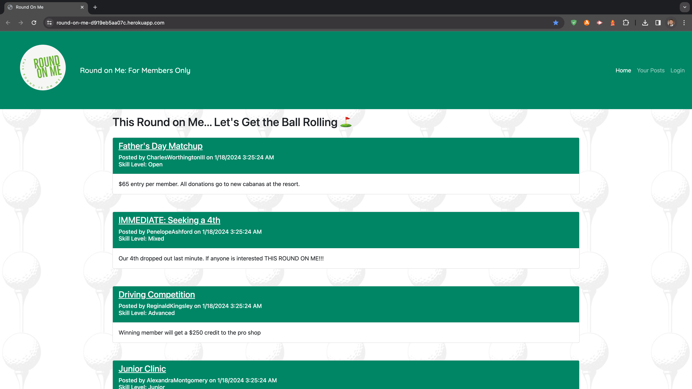

# Round On Me

## Description
Round On Me is a forum for country club members to organize golf rounds and facilitate communication regarding availability. Users can create posts, comment on posts, and share their golfing schedules.

## Features and Functionality
<li>User Authentication: Users can log in, sign up, and log out securely.</li>
<li>Create and View Posts: Members can create posts for organizing golf rounds, and others can view these posts.</li>
<li>Comments: Users can leave comments on posts to express interest or provide additional details.</li>
<li>Skill Level: Each post includes a skill level indication for better matching of golfers.</li>
<li>Responsive Design: The application is designed to work seamlessly on various devices.</li>

## Technologies Used
<li>Node.js: Backend runtime environment.</li>
<li>Express.js: Web application framework for Node.js.</li>
<li>Sequelize: Promise-based Node.js ORM for PostgreSQL.</li>
<li>Handlebars: Templating engine for HTML.</li>
<li>Express-Session: Middleware for managing user sessions.</li>
<li>Connect-Session-Sequelize: Sequelize session store for Express.</li>
<li>Argon2: Hashing algorithm for securely storing passwords.</li>

## Contributors
<li>Jonathan Abrams: https://github.com/jabrams513</li>
<li>Kenny Cummings: https://github.com/kennycummings</li>
<li>Phillip Iacone: https://github.com/p-iacone88</li>

## Deployment Link
https://round-on-me-d919eb5aa07c.herokuapp.com/

## Screenshot

